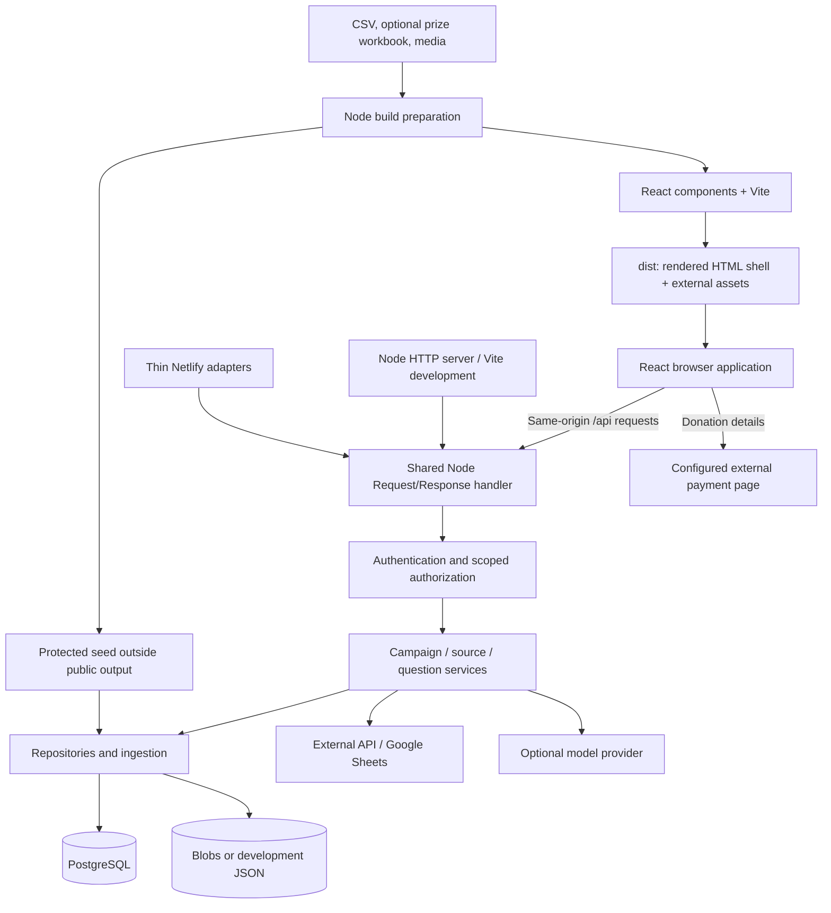

# Architecture

Updated 2026-09-09 for the Node.js/React platform migration and SQL read improvements. This describes the local implementation; it is not evidence of a production deployment.

GoodRaise models `organization → campaign → configuration, sources, donations, ambassadors, analytics`. It has one Node application boundary used by local development, the standalone server, and Netlify. The browser is a React application built by Vite. TypeScript is the default for new application code; established JavaScript logic is retained inside those platforms. Direct campaign URLs resolve an explicit public context, and reject unknown/ambiguous identifiers.

## System shape

The payment processor owns charging. GoodRaise prepares the redirect and analyzes imported results; it does not process payments.

## Stack

| Layer | Implementation |
| --- | --- |
| Runtime | Node.js 24; development and deployment baseline in `.nvmrc` |
| Frontend | React 19.2, TypeScript 7.0, Vite 8.2, Hebrew/RTL CSS |
| Browser domain logic | Existing JavaScript controller, shared deterministic intelligence module |
| HTTP | Web-standard `Request`/`Response`; Node HTTP and Netlify adapters |
| SQL | PostgreSQL, `pg`; one shared pool with maximum four connections per process/function instance |
| Auxiliary persistence | Netlify Blobs or atomic JSON development files, using the same repository interfaces |
| Data tooling | Node CSV parser and workbook reader; ordered SQL migration runner |
| Validation | TypeScript, Node test runner, real loopback HTTP tests, disposable PostgreSQL integration, browser checks |

Exact versions are locked in `package-lock.json`. There is no Python application, Python builder, SQLite server, or separate backend framework to maintain.

## Frontend ownership

`App.tsx` owns startup status and the controller lifecycle. Eleven TSX layout components define the header, public pages, manager shell, login, insights/design panels, and manual-contribution dialog. `main.tsx` hydrates the same shell rendered by `scripts/build.tsx`; direct links have initial HTML before JavaScript runs. This preserves the previous no-index policy. Campaign-specific social metadata and SSR of live donation data are not implemented.

The compatibility controller in `apps/web/src/compat/dashboard-controller.js` retains calculations, imports, filters, designer behavior, and imperative rendering of dynamic chart/table/project containers. This is intentional reuse during the platform change, not a claim that every interaction is an idiomatic React component. The fixed layout is memoized; React must not reconcile controller-owned children. Listeners use the mount's abort signal, requests are aborted on unmount, and timers are cleared. New dynamic features should use React components and explicit data/state contracts rather than expanding this adapter.

CSS, JavaScript and media are separate assets. The controller is dynamically imported. No donor rows are embedded in the HTML or browser bootstrap JSON. Protected seed data stays under `netlify/data/`; the browser requests public redacted data or the authenticated dataset.

Startup binds navigation immediately, restores the session, and reads the persisted dataset. Loading a manager page does not force an external API/Sheets refresh. Dataset loading can overlap settings loading; builder settings are applied before the authoritative source configuration so a stale source copy in the builder cannot override it. Explicit refresh and the configured session timer still fetch the source. Hosted schedules remain disabled.

## Backend ownership

| Module | Responsibility |
| --- | --- |
| `backend/app.ts` | Shared response boundary, known validation errors, request timing |
| `backend/http-handler.mjs` | Auth, legacy admin aliases and scoped route dispatch |
| `auth-store.mjs` | Allowlist, passwords, cookies, sessions, public/protected reads |
| `authorization.mjs` | Role and organization/campaign assignment policy |
| `campaign-store.mjs` | Authorized campaign configuration and creation |
| `campaign-repositories.mjs` | Records, scope context, dataset windows, audits and migration markers |
| `platform-store.mjs` | Blobs or development JSON adapter and legacy auth-store migration |
| `source-store.mjs` / `source-sync.mjs` | Source mapping, Sheets authentication, refresh, checksums and reconciliation |
| `postgres-ingest.mjs` | Ledger/raw imports, idempotency, manual matches, registrations and snapshots |
| `insight-assistant.mjs` | Server aggregates, deterministic answers, optional provider call |
| `prelaunch-reset.mjs` | Disabled-by-default reset runner and completion flags |

Service files are under `backend/services/`. Netlify owns transport packaging, not business logic. Both local and hosted requests run the same authorization, source, question and ingestion code. Differences are credentials, storage configuration and hosting limits.

Session identity lookup is separate from the auth-status portfolio response. Scoped authorization resolves just the requested organization and campaign, using two bounded SQL identity lookups and the shared role/assignment policy. Legacy routes without full scope select from identity records. Authorization does not load donation snapshots or cache permissions between requests. Explicit status and campaign-registry responses still build portfolios; they are not part of the permission check.

Campaign context uses one scoped SQL join. Portfolio summaries first read identities and apply the shared permission policy, then batch-read only amounts and summary metadata for allowed campaigns. Configuration registries omit operational dataset/source joins. Summary number conversion and summation stay in the existing JavaScript model to preserve behavior. These are query/transfer improvements, not a new stored aggregate model.

Account emails are normalized on input and constrained to lowercase storage by migration 003. SQL auth refuses to run before that migration, preventing equality lookups or seeding against unnormalized legacy accounts. Account seeding reads current configuration but only upserts the requested account, skipping unchanged values. Session expiry cleanup retains its existing behavior.

## Storage and compatibility

PostgreSQL holds the relational ledger and, when configured, campaign records/config/source/datasets and managers/sessions. Auxiliary audits, rate-limit records and job markers still use the key/value adapter. Consolidating these into SQL is a separate data migration, not accomplished by changing the runtime. See the [storage inventory](data-model.md#storage-inventory).

Development JSON mutations are serialized per file and replaced atomically in one Node process. This is not a cross-process database; concurrent servers/jobs should use PostgreSQL. Blobs retains its existing consistency behavior.

New browser keys, cookies, DOM IDs and environment variables use `goodraise`/`GOODRAISE`. Narrow compatibility readers preserve old drafts, deployed auth records and existing sessions. Campaign names, brands, source URLs and prize exclusions belong to configuration. Platform defaults no longer embed the original audience, organization story, legal rules or excluded ambassador names. Existing media files remain available for campaigns already referencing them.

## Engineering limits

The platform migration does not eliminate all scaling work: SQL summaries still enumerate identities and extract stored amounts, complete datasets still go to managers, and browser analytics still scan/sort rows. The React compatibility adapter and JS services need incremental typing/component extraction. Public campaign publication policy, manager onboarding hardening, tenant isolation at the database level, and complete SQL ownership of auxiliary state remain separate work items. See [engineering assessment](engineering-assessment.md).
