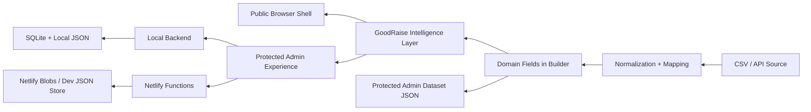

# GoodRaise Architecture

Updated: 2026-08-12

## System Overview

GoodRaise is a campaign intelligence and operations platform built around one core principle:

`Data Source -> Normalization -> Domain Interpretation -> Intelligence Models -> Admin/Public Delivery`

The repository keeps a lightweight stack:

- Python builder for deterministic dashboard generation
- Local Python backend for authenticated manager operations
- Netlify Functions path for hosted manager authentication and protected dataset access
- Static browser shell for the public and admin-facing UI
- Lightweight file/blob persistence instead of a heavy backend platform

## Main Components

### 1. Dashboard Build Layer

- File: `work/build_yellow_dashboard.py`
- Responsibility:
  - load source data
  - prepare public/admin payloads
  - inject HTML/CSS/JS shell
  - generate browser output and publishable `index.html`
  - stage the protected admin dataset

### 2. Intelligence Layer

- File: `work/frontend/goodraise-intelligence.js`
- Responsibility:
  - campaign health score
  - velocity model
  - forecast model
  - ambassador intelligence
  - intervention priorities
  - campaign fingerprint

This layer is intentionally UI-independent. The dashboard renders its output, but the rules live in a reusable module.

### 3. Local Operations Backend

- File: `work/dashboard_backend.py`
- Responsibility:
  - session auth
  - first-password setup
  - role-aware access gates
  - protected dataset delivery
  - campaign config persistence
  - source API config persistence
  - source refresh
  - health endpoint
  - audit trail

### 4. Hosted Auth / Protected Access Layer

- Files:
  - `netlify/functions/auth.mjs`
  - `netlify/lib/auth-store.mjs`
  - `netlify/lib/campaign-store.mjs`
  - `netlify/lib/source-store.mjs`
- Responsibility:
  - manager auth/status/logout
  - protected admin dataset access
  - persisted campaign/source configuration
  - runtime health snapshot

## Component Diagram

## Data Flow

### Public Path

1. Source data is loaded in the build.
2. Public-safe summary output is embedded in the generated HTML.
3. Public pages render:
   - project page
   - prizes page
   - rules page
   - privacy page
   - public campaign snapshot

### Admin Path

1. Manager authenticates through the backend.
2. Session cookie is issued.
3. Admin shell requests protected dataset and protected config endpoints.
4. Intelligence layer computes operational insights client-side from the protected dataset.
5. Manager actions update campaign/source configuration on the server side.

## Domain Model

The repository is moving toward the following internal model:

### Platform

- future top-level product scope
- hosts multiple organizations

### Organization

- branding owner
- manager scope boundary
- future isolation boundary

### Campaign

- title
- slug
- dates
- target
- status
- donation presets
- media
- design system
- data source config

### Ambassador

- identity fields
- team
- target
- donation totals
- activity history
- prize proximity
- operational status

### Donation

- donor identity fields
- amount
- timestamps
- source identifiers
- success/failure outcome

### Team

- team name
- manager
- target
- members

### Prize

- name
- threshold
- winners
- near-threshold candidates

### User

- manager email
- role
- organization scope
- campaign scope

### Role

- `platform_admin`
- `organization_admin`
- `campaign_manager`
- `analyst`
- `viewer`

## Authentication

### Local Backend

- manager allowlist seed
- first-login password creation
- PBKDF2 password hashing
- server-side session cookie
- session expiration
- local password reset helper
- password change endpoint

### Netlify Path

- allowlist seed from env/local dev file
- PBKDF2 password hashing
- server-side session persistence in Netlify Blobs or local dev file
- protected dataset gated by session status

## Authorization

Server-side authorization is now based on role metadata rather than UI visibility alone.

Current practical rules:

- `analyst` and above:
  - protected dataset access
- `campaign_manager` and above:
  - campaign config
  - source config
  - source refresh

This is a foundation for fuller organization/campaign-scoped RBAC.

## Data Persistence

### Local

- `work/data/dashboard-auth.sqlite3`
- `work/data/dashboard-source-config.json`
- `work/data/dashboard-campaign-config.json`
- `work/data/dashboard-audit-log.jsonl`

### Hosted / Netlify

- Netlify Blobs-backed auth/session/config storage
- local dev JSON fallback for verification runs

## Integrations

Current integration contract is:

`External Platform Adapter -> Normalized GoodRaise Shape -> Intelligence Engine`

Supported source modes:

- manual file upload
- configured API pull

This keeps GoodRaise integration-friendly and avoids tight coupling to a single fundraising platform.

## Analytics

The main analytics responsibilities are now separated conceptually:

- baseline KPI aggregation in the build/runtime shell
- reusable intelligence models in `work/frontend/goodraise-intelligence.js`
- visual rendering in the generated dashboard shell

## Deployment

### Local

- build outputs to `outputs/`
- backend served by `scripts/run_dashboard_server.ps1`

### Netlify

- Python build generates `outputs/index.html`
- Function endpoint handles auth + protected resources
- ignored protected files stay out of Git

## Scalability Strategy

GoodRaise is not a microservice system and does not need to be one yet.

The intended scale path is:

1. Keep deterministic single-process logic.
2. Separate domain/data/intelligence concerns.
3. Persist campaign configuration server-side.
4. Keep adapters external-platform-specific and intelligence-platform-agnostic.
5. Replace local/blob persistence with a structured database later without rewriting the intelligence layer.
