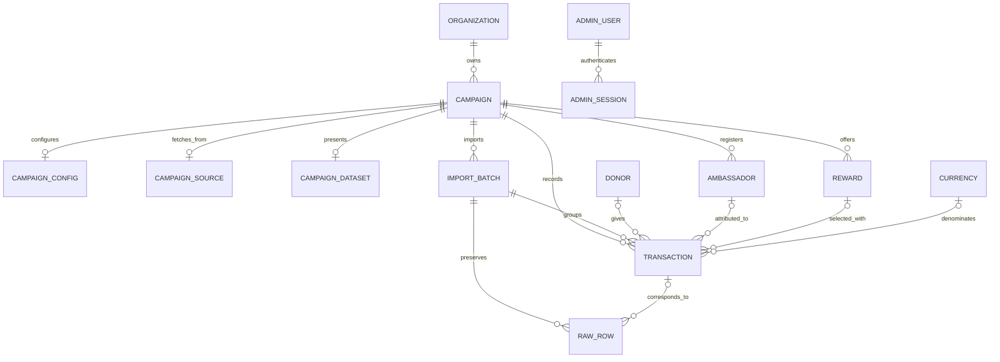

# Data model and flows

Updated 2026-09-08 after platform migration. Primary sources: [baseline schema](../db/migrations/001_initial.sql), [repositories](../backend/services/campaign-repositories.mjs), [ingestion](../backend/services/postgres-ingest.mjs), and [source synchronization](../backend/services/source-sync.mjs).

## Domain model

An organization owns campaigns. Each campaign has independent presentation/settings, source configuration, a dashboard dataset, and operational records. A donor is the person giving money; an ambassador is the person credited with bringing it in. Imported rewards describe donation-associated items; configured competition prizes are a separate concept.



This diagram simplifies SQL foreign keys. Campaign-owned tables also carry `organization_id`. **`donors` and `currencies` are shared tables**; donors do not have tenant columns. Authorization is implemented in application code, not PostgreSQL row-level security.

## SQL tables

All tables are under the `goodraise` schema.

| Table | Contents and important identity rules |
| --- | --- |
| `organizations` | UUID primary key, globally unique slug, optional unique `app_id`, name/status |
| `campaigns` | UUID primary key, organization FK, organization-scoped slug and optional `app_id`, dates, currency, target, source metadata |
| `campaign_configs` | One JSONB `payload` per campaign, revision and update metadata |
| `campaign_sources` | One JSONB source configuration per campaign, secret-present flag and update metadata |
| `campaign_datasets` | One JSONB rows/meta snapshot per campaign, row count and generation/update timestamps |
| `campaign_public_snapshots` | Sanitized completed-campaign read model, completion timestamp and update timestamp |
| `import_batches` | Source filename/checksum, raw columns/counts, import metadata; unique campaign/checksum |
| `transactions` | Amount, occurrence time/raw time, payment status, raw JSON, canonical/source keys; links campaign, batch, donor, ambassador, reward, currency |
| `transactions_csv_raw` | Source-column parity including Hebrew/spaced column names, row number and optional transaction link |
| `donors` | Globally unique derived `donor_key`, contact/address fields; shared across campaigns |
| `ambassadors` | Campaign-scoped identity plus name/email, nickname, registration/contact/consent metadata |
| `rewards` | Campaign-scoped imported reward identity/details |
| `currencies` | Currency code/name lookup |
| `admin_users` | Unique trimmed lowercase email (migration 003), password hash, global/legacy role fields, access hash and activity timestamps |
| `admin_memberships` | User-to-organization/project role assignments; organization admins have a null campaign, other roles target one campaign |
| `admin_sessions` | User reference, session token, creation and expiry timestamps |
| `schema_migrations` | Applied migration name/checksum and timestamp |

Account emails are case-insensitive throughout setup/login. Migration 003 normalizes legacy values while preserving account UUIDs, password hashes and session references; it stops on case/whitespace collisions. New account SQL uses indexed `email = $1` with normalized input. Canonical donor/ambassador matching already uses normalized email fields; raw source payloads are retained for provenance and are not rewritten by this account migration.

SQL amounts use fixed-precision numeric columns; JavaScript snapshots and calculations use `Number`. Manual matches currently use `ILS` explicitly. There is no currency-conversion pipeline.

Teams, competition prizes, builder permissions metadata, and the builder ambassador directory are nested in configuration JSON, not independent repository entities. Registration ingestion also writes `ambassadors` rows. `buildCampaignContext()` reads its directory from `config.ambassadors.records`; changes to relational registration data and changes to builder JSON should not be assumed to propagate in both directions automatically.

## Storage inventory

| State | Node with SQL | Hosted without SQL | Development without SQL |
| --- | --- | --- | --- |
| Organizations/campaigns/config/source/dataset | PostgreSQL | `goodraise-platform` Blobs | `goodraise-platform-dev.json` |
| Completed-campaign public snapshots | PostgreSQL | `goodraise-platform` Blobs | `goodraise-platform-dev.json` |
| Users/memberships/sessions | PostgreSQL | `goodraise-auth` Blobs, legacy reads supported | `netlify-auth-dev.json` |
| Auth limits and auth audit | Blobs or development JSON | Same | Same auth JSON file |
| Campaign audit/migration/reset flags | Blobs or development JSON | Same | Platform JSON file |
| Ledger/raw imports/registrations | PostgreSQL | Unavailable | Unavailable |
| Full build seed | `netlify/data/admin-dataset.json` | Same | Same |
| UI drafts/preferences | Browser localStorage | Same | Same |

Development files live under `GOODRAISE_DATA_DIR` or `work/data`. There is no SQLite runtime. Auth store migration reads the old physical namespace and prevents deleted sessions from being restored. Auxiliary-state consolidation into SQL remains separate work.

Key/value campaign records use `organization:{org}`, `campaign:{org}:{campaign}`, `campaign-config:{org}:{campaign}`, `campaign-source:{org}:{campaign}`, `campaign-dataset:{org}:{campaign}` and `campaign-public-snapshot:{org}:{campaign}`. File mutations are serialized and atomic in one Node process; this is not cross-process locking.

## Dashboard dataset contract

The dataset is a denormalized view for the browser, not the complete relational record:

```json
{
  "organizationId": "example-org",
  "campaignId": "autumn-drive",
  "rows": [{
    "id": "donation-001",
    "createdIso": "2026-09-01T10:30",
    "date": "2026-09-01",
    "hour": 10,
    "email": "donor@example.org",
    "donor": "Example Donor",
    "ambassador": "Example Ambassador",
    "amount": 180,
    "city": "Example City",
    "status": "success",
    "chargeResult": "000"
  }],
  "meta": {
    "rowCount": 1,
    "projectDates": ["2026-09-01", "2026-09-02"],
    "defaultFrom": "2026-09-01",
    "defaultTo": "2026-09-02"
  },
  "sourceLabel": "example-source",
  "generatedAt": "2026-09-01T10:35:00.000Z"
}
```

The public projection blanks email, city, and charge result, replaces the donor name, and retains ID, time, amount, ambassador, and status. It is redacted row-level data, not an aggregate-only API.

The completed-campaign archive uses a stricter boundary than that legacy projection. Its snapshot contains only organization/campaign presentation, final successful amount, goal, percentage, unique successful-donor count, currency and dates. It never stores donation rows, donor/ambassador identities, source configuration, prizes or analytics. Ordinary copy/media edits regenerate presentation while retaining frozen financial totals; `npm run backfill:completed-campaigns -- --rebuild-financials` is the explicit site-operator recalculation path.

`buildCampaignContext()` preserves stored dataset `projectDates` when available; builder/campaign dates fill in only when those dates are absent. Saving campaign configuration explicitly updates dataset window metadata via `syncCampaignDatasetProjectWindow()`. Snapshot precedence is covered by the campaign-date and assistant regression tests; configuration saves deliberately update that window.

## Different ingestion paths

| Entry | Writes ledger? | Writes server dataset? | Important behavior |
| --- | --- | --- | --- |
| Node build preparation | No | Writes protected seed file | Uses configured CSV or sample; first-use migration can copy it into records |
| Browser base/comparison CSV upload | No | No | Replaces current browser state after validation; comparison is separate in-memory state |
| Hosted generic API refresh | No | Yes | Fetches/maps JSON or CSV and replaces normalized campaign snapshot, even with SQL configured |
| Hosted Sheets without SQL | No | Yes | Saves normalized snapshot in fallback store |
| Hosted Sheets with SQL | Yes | Yes | Reconciles full external snapshot; batch ledger and dataset writes share a transaction |
| External single-record `/ingest` | Yes | Yes, after SQL commit | Appends/replaces a dataset row; snapshot update is outside the ledger transaction |
| Manager manual contribution | Yes | Yes | Uses the transactional batch ingestion path; marks row as `manual_match` |
| Node import CLI | Yes | Yes, in batch transaction | Existing scoped campaign; additive/updating CSV import with canonical deduplication |

Consequences: a browser CSV can change visible charts without changing the server question assistant's data. A generic API snapshot may diverge from the ledger until a ledger-based rebuild replaces it. Do not use “import” as if all of these paths have the same persistence contract.

## Google Sheets to dashboard

```mermaid
sequenceDiagram
    participant Trigger as Manager or Node runner
    participant Sync as source-sync
    participant Sheet as Google Sheets
    participant SQL as PostgreSQL
    participant API as Dataset API
    participant Browser as Browser
    Trigger->>Sync: syncCampaignSourceOnce(org, campaign)
    Sync->>Sheet: Fetch configured sheet/tab/range
    Sheet-->>Sync: Raw rows, content hash, resolved tab
    Sync->>SQL: Read ledger summary
    alt Unchanged checksum, normalizer version, and matching ledger; not forced
        Sync->>SQL: Mark snapshot freshness
    else Import needed
        Sync->>SQL: BEGIN and try campaign advisory lock
        Sync->>SQL: Upsert changed records; remove absent external rows
        Sync->>SQL: Rebuild successful-row snapshot; COMMIT
        Sync->>SQL: Compare ledger total/count to source
    end
    Sync-->>Trigger: Summary and source status
    Browser->>API: GET scoped dataset
    API-->>Browser: Saved rows and metadata
    Browser->>Browser: Filters, totals, charts, intelligence
```

`source-store.mjs` supports public CSV and service-account reads. When a tab is unspecified, it can inspect candidate tabs for transaction headers/data and persist the resolved selection. Field mapping translates source columns into the canonical donation contract.

`source-sync.mjs` compares content hash, a hardcoded normalizer version, and ledger count/amount. The normalizer version deliberately forces reprocessing after mapping changes. Manual refresh sets `force: true`; runner passes can skip unchanged content. Reconciliation excludes manual matching contributions so legitimate manager entries do not appear as a Sheets discrepancy.

`ingestCampaignRecords()` normalizes/validates records, acquires a campaign advisory transaction lock, deduplicates repeated keys, updates changed records, and writes raw rows. With `replaceExternalSnapshot: true`, it deletes campaign transactions absent from the current source, excluding `manual_match` rows. This applies to all non-manual campaign ledger rows, not only rows originally imported from that specific sheet.

The deletion branch runs only when normalized source rows are nonempty. An empty/invalid sheet does not automatically clear the entire ledger. Reconciliation happens after the transactional import; a reconciliation error is not a rollback of a committed import.

## Identity, status, and deduplication

In Node, the canonical event key is SHA-256 of `source-id:<id>` when the incoming ID exists. Without an ID, it hashes a stable object including time, donor contact/name, total, currency, ambassador email, charge result, and charge status. SQL uniqueness is `(campaign_id, canonical_event_key)`.

This suppresses repeated delivery of an identified donation in the same campaign. It also means two unrelated providers using the same source ID in one campaign collide; changing a field-based fallback identity may create a new event. A manual contribution's supplied `requestId` becomes part of its synthetic source ID; reuse it to make a retry refer to the same contribution.

Payment-status rules differ by path. The SQL snapshot rebuild selects only `charged_success = TRUE`. Node ingestion accepts several explicit truthy representations, including `true`, `1`, and `yes`; false or absent values do not qualify. Node build preparation reuses canonical record normalization. The browser CSV parser retains its existing stricter parsing and may retain failed rows in its base dataset. General browser filters do not universally remove failed rows; prize scope explicitly does. Analytics consistency therefore depends on the input path, not just the visible filters.

Timestamps also cross several parsers: canonical Node timestamp normalization for build/ingest records, browser-local dates in UI helpers, and SQL `TIMESTAMPTZ` in the ledger. Raw timestamp fields are preserved. A single organization-timezone policy is not modeled in the domain; verify day/hour boundaries when changing date handling.

## Migration and reset behavior

`ensureMultiTenantMigration()` checks `migration:legacy-registry-v2`. If records already exist, it writes a skipped/completed marker. Otherwise it normalizes the legacy registry, writes campaign records, and may copy the **same legacy source and dataset into each migrated campaign**. This is compatibility seeding, not a data partitioning migration. Legacy data files are retained.

The reset flow checks enablement, time and selected campaign, then removes operational SQL records and stores an empty dataset and a completion marker. It deletes campaign transactions, raw rows, batches, **relational ambassadors and rewards**, plus globally unreferenced donors. Builder configuration remains, including its nested ambassador directory. The marker is in the auxiliary store, and dataset clearing occurs after the ledger deletion commits; the operation is not one atomic transaction across all stores.

Reset and import behavior were tested only in a disposable PostgreSQL cluster; no live import/reset was executed. See [operations](development.md#deployment-and-jobs) before invoking the retained runners.
