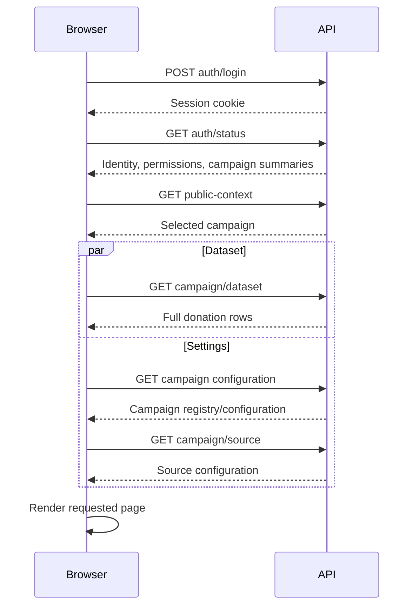

# Login and campaign-page performance check

Measured on 2026-09-09. Baseline: source commit `2f1ec09` and its frontend assets served by `https://goodraise.netlify.app`. The optimizations described below are local, verified changes and have not been deployed.

## Implemented changes and comparison

Login, Project and Prizes now have a shorter loading path. Management analytics, campaign configuration and source settings load when the management dashboard is opened.

- The rendered login form works without waiting for session restoration or importing the campaign controller. Fonts no longer block the main stylesheet.
- Session restoration requests identity and permissions only. Login/setup returns that identity directly, avoiding the second status request.
- Project/Prizes request one authorized campaign view, in parallel with importing their controller. This response contains presentation settings, prize rules and the donation fields used by totals/rankings; it excludes donor contact fields and administrative settings.
- Header navigation between Project and Prizes retains the document and makes one fresh authorized campaign request. Back/forward and personalized ambassador links retain their context.
- Server role, tenant, campaign assignment and revocation checks remain in place. Unscoped campaign selection is covered by parity checks against the existing context endpoint.

| Work | Before | After |
| --- | ---: | ---: |
| API requests after login submission, opening Project | 6, across 5 dependent stages | 2, across 2 dependent stages |
| API requests opening an authenticated Project/Prizes URL | 5, across 4 dependent stages | 2, across 2 dependent stages |
| Project ↔ Prizes header navigation | Full document reload | 1 campaign-view request, same document |
| Decoded campaign response, 1,000 donations | 268,116 bytes | 160,470 bytes |
| Decoded campaign response, 10,000 donations | 2,710,821 bytes | 1,604,000 bytes |

Local browser medians, three samples per scenario, using the production build and disposable PostgreSQL:

| Scenario | Before | After | After range |
| --- | ---: | ---: | ---: |
| Submit login → project ready, 1,000 donations | 217 ms | 64 ms | 64–95 ms |
| Open project, 1,000 donations | 128 ms | 64 ms | 55–64 ms |
| Open prizes, 1,000 donations | 114 ms | 61 ms | 49–63 ms |
| Open project, 10,000 donations | 163 ms | 97 ms | 95–97 ms |
| Open prizes, 10,000 donations | 162 ms | 106 ms | 104–114 ms |

These measure application/DOM readiness, not full visual completion. They exclude finishing the existing 180 ms page fade and all image/font loading. The first post-change diagnostic run had four 56–97 ms long tasks during its initial login-page visit; the final repeated run had none. Small samples on a development computer do not establish a performance percentile or capacity limit.

Validation passed: production build, type checking, release-content verification, all 71 tests and PostgreSQL integration. Browser checks covered login during a delayed anonymous status response, password setup and confirmation, wrong passwords, viewer denial, ambassador deep links, displayed fundraising totals, same-document navigation, back/forward, logout, public legal pages, full dashboard donor data, and a remembered design tab without settings requests on Project. No browser errors occurred in the successful navigation/dashboard check.

## Baseline results

The first visit to the live login page has noticeable loading delay. Repeat visits improve substantially. Controlled successful-login and campaign-page tests are fast on local PostgreSQL, but the application repeats a sequence of API requests that will compound latency on the hosted site.

**Successful production login and authenticated production page readiness were not measured.** An authenticated production session was unavailable. The local figures must not be presented as production results.

| Scenario | Environment | Samples | Median | Observed range |
| --- | --- | ---: | ---: | ---: |
| First login-page visit until application ready | Netlify, first visit in measured browser | 1 | 3.685 s | — |
| Repeat login-page visit until application ready | Netlify, warm browser cache | 2 | 1.087 s | 0.729–1.445 s |
| Submit login → project ready, 1,000 donations | Local PostgreSQL | 3 | 0.217 s | 0.129–0.278 s |
| Open project, 1,000 donations | Local PostgreSQL | 3 | 0.128 s | 0.116–0.433 s |
| Open prizes, 1,000 donations | Local PostgreSQL | 3 | 0.114 s | 0.110–0.162 s |
| Open project, 10,000 donations | Local PostgreSQL | 3 | 0.163 s | 0.147–0.175 s |
| Open prizes, 10,000 donations | Local PostgreSQL | 3 | 0.162 s | 0.162–0.173 s |

First contentful paint on the live login page was 2.0 s and 2.2 s in two separate first-visit captures; repeat visits painted at 0.316–0.324 s. No long tasks over 50 ms were observed in the instrumented production-guest or local campaign runs. These are small diagnostic samples from one computer, not load-test results or service-level percentiles.

## Baseline flow causing the wait

The source references in this section describe the behavior at `2f1ec09`, before the changes above.

### Initial frontend loading is sequential

One first-visit production capture had this sequence, relative to navigation start:

| Work | Start | Finish |
| --- | ---: | ---: |
| HTML response | 0.654 s | 0.764 s |
| Main JavaScript and stylesheet downloads | 0.676 s | about 1.303 s |
| Google Fonts stylesheet imported by dashboard CSS | 1.307 s | 1.887 s |
| First contentful paint | — | 2.000 s |
| Dynamically imported campaign controller | 1.992 s | 2.496 s |
| Anonymous auth-status request | 2.546 s | 2.808 s |

The page imports the font stylesheet from [dashboard.css](../apps/web/src/styles/dashboard.css:1), and [App.tsx](../apps/web/src/App.tsx:15) imports the controller after React mounts. Session restoration then begins inside that controller. Even the guest login form loads the complete campaign application and controller.

Across four browser samples, the anonymous status request took 0.235–0.936 s, while its `Server-Timing: app` duration was only 15.8–91.4 ms. Most of that request's elapsed time lies outside the timed handler. Network transit, hosting overhead and instance startup are not individually instrumented, so these measurements do not isolate a particular infrastructure cause.

### Signed-in campaign pages load dashboard data and settings

The measured local request sequence after submitting login was:

There are six API requests after login submission, with five request stages on the critical path. Opening another project/prizes page while already authenticated repeats five requests across four stages.

[hydrateAuthSession](../apps/web/src/compat/dashboard-controller.js:2615) uses the same protected-data loader for every application page. [loadProtectedManagerData](../apps/web/src/compat/dashboard-controller.js:3175) always waits for campaign configuration and then source configuration, even though the call passes `includeCampaignBuilder: false`. That option is currently unused.

Both auth status and public context enumerate accessible campaign summaries. Context discovery does this even when the URL already contains both organization and campaign IDs. This is avoidable repeated work, while the underlying scoped authorization remains necessary.

The new header uses normal anchors; [the controller leaves those anchors to browser navigation](../apps/web/src/compat/dashboard-controller.js:7092). Consequently, switching between Project and Prizes reloads the application and repeats session/context/data loading instead of retaining the current authorized campaign view.

### Payload grows with campaign size

The local protected dataset was approximately 268 KB of decoded JSON for 1,000 rows and 2.71 MB for 10,000 rows. Project and prizes pages currently receive the full administrative dataset, including fields they do not display. Local HTTP did not compress these responses; hosted transfer sizes were not measured for authenticated endpoints and may differ.

The 10,000-row fixtures did not show a long browser task. This does not establish a capacity limit: these fixtures used simple branding, 80 synthetic ambassadors, a fixed ten-day window and two campaigns, and did not benchmark the full managerial analytics dashboard.

## Production follow-up

After deployment, measure first-visit login readiness, successful login and Project/Prizes navigation on the same real campaign. The removed requests and loading dependencies should reduce the hosted wait, but the size of that improvement remains unmeasured. The large base React layout still ships to the login page, and hosting/network overhead remains a possible further target once the production trace is available.

## Method and artifacts

Production samples used the deployed site over the normal connection from this computer, without artificial throttling. A separate headed browser captured the first visit; an isolated browser captured three additional anonymous login-page visits. Frontend asset names matched the local release (`index-CVpEyhwu.js`, `dashboard-controller-CHtEATUC.js`).

Local samples used Node v26.7.0, a disposable PostgreSQL database, the production build, and a 1280×720 browser viewport. Campaigns contained 1,000 and 10,000 synthetic donation rows and 80 synthetic ambassadors; no production database or donor records were copied. Three successful test logins and twelve authenticated page visits were measured. The database, browser, and API were on the same computer.

Timing came from browser Navigation/Resource/Paint Timing, server `Server-Timing` headers, and temporary browser-only observers. Application readiness means the loading indicator was removed and the requested view became active, followed by two animation frames. Login time starts at form submission and ends when the authorized view becomes active, excluding credential typing. This DOM-readiness measure is distinct from first contentful paint or complete loading of all images. The collectors retain durations, URLs without sensitive query values, sizes and active-page IDs, not passwords, cookies or donation bodies.

Raw measurements and the disposable harness are under the ignored `output/playwright/performance/` directory. `summary.csv` contains the before/after comparison; `local-browser-result.txt` is the baseline and `local-browser-final.txt` is the final local run. `navigation-result.txt` and `setup-and-roles-result.txt` record browser checks. No production accounts or data were changed. The extra setup/viewer accounts and ambassador directory entry used for functional checks were synthetic and local.
