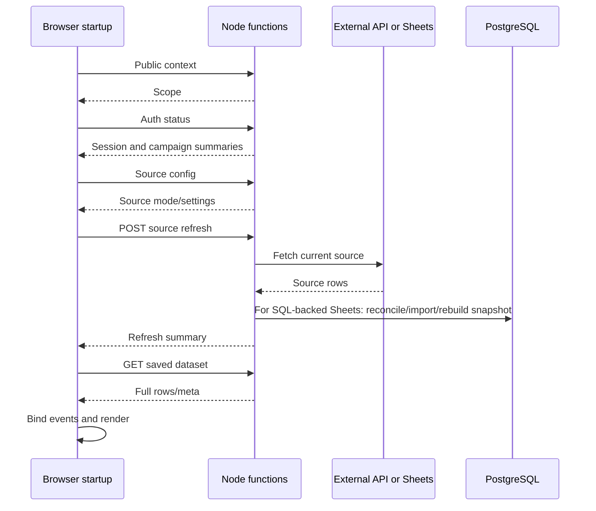

# Loading performance investigation

Date: 2026-09-08, source baseline `4c3aff6`. Trigger: slow frontend loading reported during the stack-consolidation discussion. The affected deployed URL, interaction, data volume, and loading time have not yet been identified. This is a source trace plus controlled local measurements, not a production latency diagnosis. The findings below describe that pre-migration baseline.

## Changes implemented after the baseline

The platform migration replaced the Python builder/server with React/Vite and one Node backend. Manager startup now reads saved data without forcing external sync, and binds navigation before awaiting data. The rendered shell is about 38 KB; CSS/JS/images are external assets. One shared SQL pool replaces the three separate pools. Browser request inspection confirmed no source-refresh POST during login.

Scoped authorization now validates the session independently of auth status, then resolves the requested organization and campaign directly. The two implicit portfolio passes described in finding 2 are removed from this path. Incomplete legacy scopes select from identity records without loading snapshots. Explicit auth-status and portfolio/registry responses retain their existing data contracts. Additional SQL improvements were implemented on 2026-09-09 as described below. Large-dataset browser computation remains unoptimized. No deployed end-to-end latency has been measured. Baseline source locations below refer to functions extracted into their current modules; the startup sequence itself has changed. See [migration record](platform-migration.md).

### Direct authorization validation

The disposable PostgreSQL integration suite now traces actual executed statements around the permission check and a protected dataset request, with one configured manager and warmed schema/migration initialization:

| Campaigns in the database | Total SQL statements for scoped authorization | Identity lookups | Dataset reads during authorization |
| --- | --- | --- | --- |
| 2 | 7 | 2, each bounded to one record | 0 |
| 50 | 7 | 2, each bounded to one record | 0 |

The complete scoped dataset endpoint reads the requested dataset once with 50 campaigns present. These are query-count checks, not latency claims. Session lookup, expiry cleanup and manager seeding account for the other statements. Seeding now attempts only the requested configured account and skips unchanged SQL updates; a separate fixture verifies this with 101 configured managers. Direct scope authorization itself needed no schema change.

The same permission cases run against development storage and PostgreSQL: per-membership role thresholds, one account with different roles across organizations, cross-tenant access (including duplicate slugs), ID/slug assignments, incomplete legacy scope, route/query precedence, changed assignments, disabled accounts and revoked sessions. The seventh statement reads only the authenticated user's indexed membership rows. The auth-status list uses the same authorization policy as direct access. Existing campaign registry/portfolio response checks remain in the general regression suite.

### SQL read improvements and email normalization

- **Campaign context:** one joined query replaces 12 statements (5 organization reads, 4 campaign reads and 3 payload reads). Bounded CTEs preserve organization-first scope resolution and application-ID precedence over slugs. Unique campaign foreign keys keep config/source/dataset joins one-to-one; missing optional records use the same defaults. Registry configuration reads omit source/dataset joins entirely.
- **Portfolio summaries:** two queries replace `2 + 6 × campaign count`. The first reads campaign identities; the shared authorization policy filters those records before the second query fetches any donation amounts. Organization list requests also apply their organization filter first. The second query returns only ordered amounts, timestamps and fallback target values. Existing JavaScript conversion, summation order and response fields are retained, including empty datasets and legacy numeric-string amounts.
- **Payload measurement:** with 53 synthetic campaigns, the amount/metadata query returned 19,158 bytes, compared with 519,291 bytes for just one full synthetic dataset. This illustrates the fixture's reduced transfer, not a production-size estimate. Summaries still scan stored amounts in PostgreSQL and add them in Node; they are not precomputed aggregates. Browser dataset pagination and analytics work remain separate.
- **Account writes:** lookup-time seeding processes only the requested configured account and compares an access hash before replacing role/membership state. Current configured roles/assignments/active state are still checked on every request without rewriting unchanged memberships. The existing expired-session cleanup remains unchanged; moving it requires a defined maintenance schedule.
- **Email lookup:** account input was already trimmed/lowercased. Migration `003_normalize_admin_email.sql` normalizes legacy stored values and enforces that invariant. Account queries now use `email = $1`; an execution-plan check with 20,000 synthetic accounts confirms use of the existing unique email index. No expression index is added.

The PostgreSQL suite compares summaries against the prior repository flow, checks context fields and date-window precedence, and verifies restricted/unknown/alias scopes. Email cases cover mixed-case setup/login, unchanged-row versions, password changes, expired/revoked sessions, normalization preserving account IDs/password hashes/session references, and rollback on case/whitespace collisions. A separate unmigrated database verifies SQL auth refuses to seed accounts before migration 003. See [rollout instructions](development.md#database-workflow). The subsequent [Neon production rollout](database-rollout-2026-09-09.md) applied migrations 001–003 after a snapshot and rehearsal; no account or session values changed. Hosted application latency remains unmeasured.

## Assessment

The source contains substantial avoidable work on the page-loading path. There is stronger evidence for request sequencing, repeated database access, and frontend workload than for a fundamental Node.js capacity limit.

Node handles asynchronous network I/O; long synchronous JavaScript, serialization, or crypto can block its event loop. Suitability depends on work per request and measured CPU/concurrency, not a general “strong enough” rating. Moving the same serial requests and SQL access pattern to another language would retain much of the waiting. [Node.js performance guidance](https://nodejs.org/learn/asynchronous-work/dont-block-the-event-loop)

## Finding 1: opening the manager view can force source synchronization

In the pre-migration frontend builder (now extracted into the [controller](../apps/web/src/compat/dashboard-controller.js)):

1. Startup awaits `hydrateAuthSession()` before binding events and calling the final `renderAll()`.
2. `hydrateAuthSession()` awaits public context, then auth status, then `loadProtectedManagerData()` for a signed-in manager.
3. `loadProtectedManagerData()` first fetches source config. For `api` or `google_sheets`, it awaits `refreshSourceDataFromApi()` instead of first loading the saved dataset.
4. `refreshSourceDataFromApi()` posts source-refresh and only then fetches the protected dataset in the hosted path.
5. Campaign switching and login also reach this protected-data loader.



[Source refresh](../backend/services/source-sync.mjs) calls `syncCampaignSourceOnce(..., force: true)`. The unchanged-Sheets shortcut requires `!force`, so manager refresh bypasses it. Batch ingestion still compares records and can avoid rewriting unchanged transactions, but it rebuilds the SQL snapshot even when no records need writing.

**Implication:** initial manager readiness depends on the external source and possible ledger work, even if a usable saved snapshot exists. The fallback to saved data occurs after refresh fails. Public visitors do not trigger the same signed-in refresh branch, so their latency must be investigated separately.

**Proposed change:** load the authorized saved snapshot first, display freshness, and separate refresh from initial readiness. A background refresh may update the view when complete; a manual refresh should remain explicit. Handle campaign switches so late responses cannot overwrite another campaign. Current hosted schedules are disabled, so a source-refresh policy must be specified rather than assumed.

## Finding 2: campaign summary enumeration multiplies SQL queries

[Repositories](../backend/services/campaign-repositories.mjs), `listCampaignSummaries()`:

- Reads all organizations and all campaigns.
- Iterates campaigns sequentially.
- For each campaign, reads dataset and config sequentially.
- Each payload read resolves organization, resolves campaign, then selects `payload`: three SQL statements.
- Dataset reads fetch the entire JSONB dataset, even though this call returns a summary.

On the normal PostgreSQL path with existing records and runtime schema initialization excluded:

```text
One summary pass = 2 + (6 × number of campaigns) SQL statements
```

A temporary local harness ran the real repository functions against an intercepted fake `pg.Pool`. It checked the interception before importing the repository; no database connection or network request was made. Synthetic records supplied successful organization/campaign/payload lookups.

| Synthetic campaigns | SQL statements per pass, excluding initialization | Full dataset payload reads |
| --- | --- | --- |
| 1 | 8 | 1 |
| 10 | 62 | 10 |
| 50 | 302 | 50 |

[Auth scope resolution](../backend/services/auth-store.mjs) calls `requireManagerAccess()` → `getAuthStatus()` → `getAccessibleCampaignSummaries()`, and then calls `getAccessibleCampaignSummaries()` again. Both enumerate before filtering by user scope. Thus a successful protected scoped request with 10 campaigns performs **124 SQL statements for those two summary passes alone**, excluding session/admin access, the requested operation, initialization, and auxiliary-store work. Several startup API calls take this path independently.

This is query-count evidence, not a timing or query-plan benchmark. Even indexed lookups incur round trips. With serial calls, network latency can dominate while database execution time and Node CPU remain small.

**Proposed change:** authenticate once per request, resolve/authorize the requested scope directly, and make portfolio summaries a dedicated scoped query over summary columns or precomputed aggregates. Reuse resolved IDs inside the request. Read a full campaign dataset only when needed. Do not bypass tenant checks to reduce work.

## Finding 3: auth performs maintenance writes on read paths

`getAdminRecord()` invokes `ensureAdminSeed()`, which upserts every configured manager. SQL `getSessionRecord()` deletes expired sessions before looking up the presented token. These operations recur through authenticated reads.

**Proposed change:** separate provisioning and expiry cleanup from routine identity lookup, while retaining immediate revocation checks. This needs an explicit access-lifecycle contract, not a long-lived authorization cache.

## Finding 4: payload and browser work are material

The generated local artifacts from the synthetic sample build measured:

| Artifact | Raw bytes | Locally calculated gzip bytes |
| --- | --- | --- |
| `outputs/index.html` | 1,236,407 | 553,929 |
| `outputs/goodraise/index.html` | 4,553,446 | 3,406,374 |

The dashboard has about 1.11 MB of inline script text, including embedded data/assets; about 655 KB of base64 image text is embedded in the HTML. These categories overlap and must not be summed. The marketing page size is dominated by embedded images. These are local file measurements; actual deployed content and HTTP compression were not checked.

Dataset APIs deliver full row arrays. The browser parses/enriches them, validates rows, and repeatedly filters/groups/sorts for rendering and intelligence. `renderAll()` and the engine's model calls can recompute overlapping work.

The existing `node scripts/benchmark_intelligence.mjs` was run once on local Node v26.7.0. Its combined health/forecast/ambassador/priority/attention/fingerprint calls, with 80 synthetic ambassadors, took:

| Synthetic donation rows | Combined calculation time |
| --- | --- |
| 1,000 | 146.32 ms |
| 10,000 | 251.68 ms |
| 100,000 | 2,267.52 ms |

This executes the browser engine in Node, without DOM, HTTP, or database work. It is neither a browser profile nor a backend-capacity test; one run also includes runtime warmup effects. The generated timestamps span progressively longer periods as row count grows, so this is a synthetic workload rather than a realistic fixed-duration campaign model. It nevertheless shows that transferring all calculations to the browser is not cost-free.

**Proposed change:** deliver initial totals and limited table rows, load details on demand, avoid repeated computations for unchanged data, and separate assets/code so they can be cached and loaded independently. Decide which authoritative aggregates belong on the server; use browser profiling before selecting a worker or other optimization. A move to React alone does not remove this work.

## Database connections and hosting: still unmeasured

Before migration, the auth, campaign-repository, and ingestion modules each maintained a pool promise with `max: 4`, a 10-second idle timeout, and a 10-second connection timeout. This allows reuse within warm instances, but is not a global connection ceiling. Function concurrency, cold instances, database wakeup behavior, region distance, and connection wait must be measured. Increasing pool size blindly can increase database contention. [node-postgres pooling](https://node-postgres.com/features/pooling)

No production query plan, index selectivity, lock wait, connection latency, database utilization, or serverless cold-start measurement was collected. Missing indexes and Node CPU saturation are possibilities, not established causes.

## Measurement and implementation order

1. Identify the exact slow URL and interaction. Capture cold/warm browser waterfalls, time until usable controls, transferred bytes, and long main-thread tasks, using a representative campaign.
2. Correlate API timings for auth, scope resolution, connection acquisition, SQL execution/count, external source fetch, ingestion, and JSON serialization. Capture durations/counts without logging donor data or credentials.
3. Inspect slow read-query plans with representative parameters and PostgreSQL `EXPLAIN (ANALYZE, BUFFERS)` in a suitable environment. `ANALYZE` executes the statement; do not apply it casually to writes. [PostgreSQL EXPLAIN guidance](https://www.postgresql.org/docs/current/using-explain.html)
4. Remove forced sync from initial readiness and replace repeated portfolio/dataset loading with bounded scoped queries. Move auth maintenance out of read paths.
5. Reduce payload and repeated browser computations. Measure after each change against the same scenario and verify totals, scope, freshness, and campaign switching.
6. Reconsider backend runtime or hosting only if the remaining profile justifies it. Team familiarity is a valid stack criterion; unmeasured frontend latency is not evidence that one language is too weak.

These changes can be made before the proposed React/TypeScript migration. No production request, source refresh, database mutation, code fix, or deployment was performed for this investigation.
